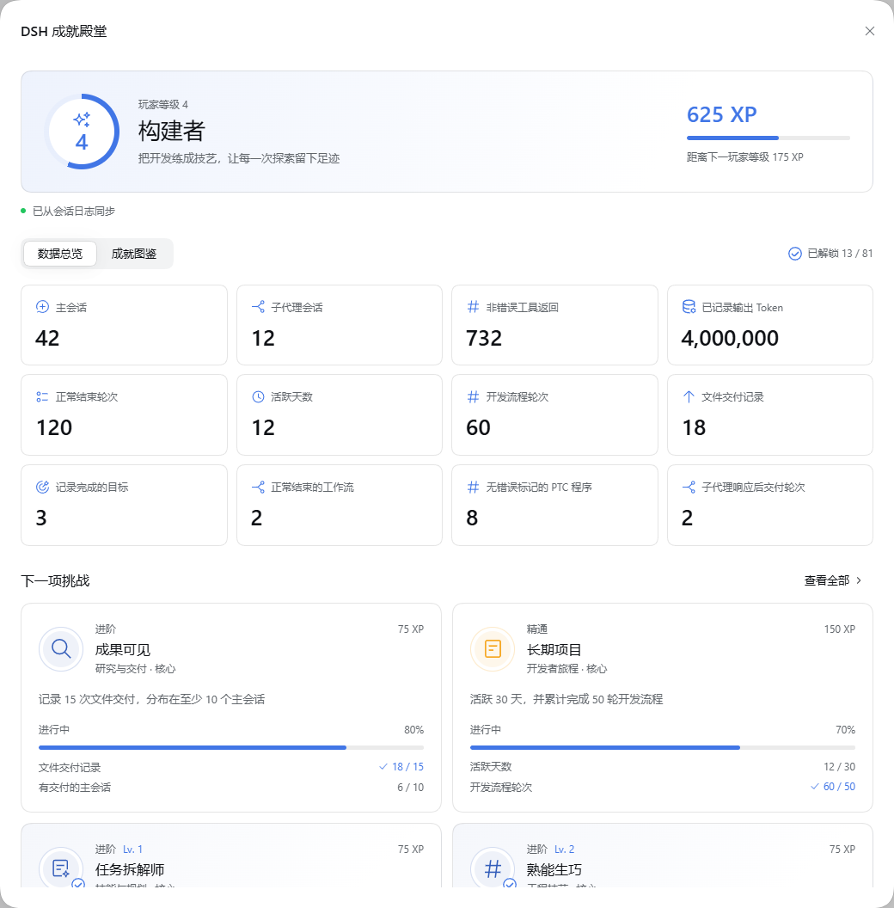
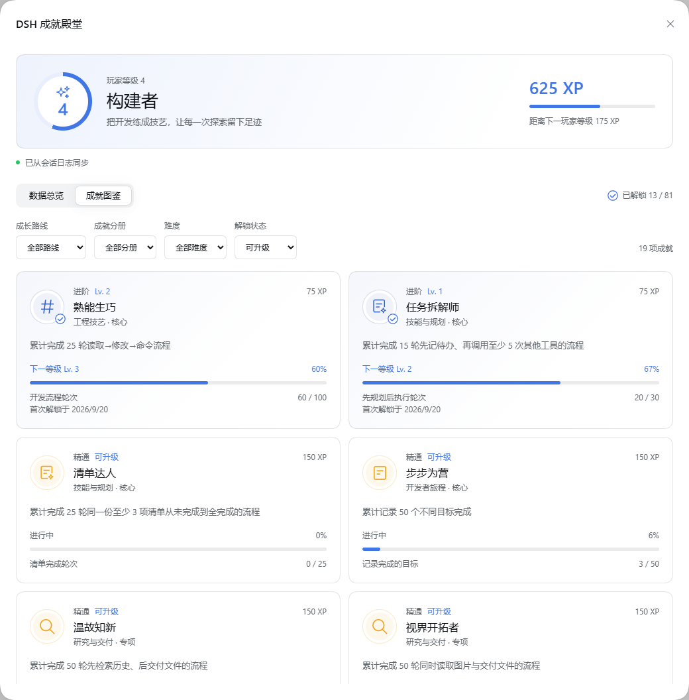

# DSH Achievement Hall

[中文](README.zh-CN.md)

Local usage statistics and 81 achievements for DeepSeek Harness: 72 public achievements and 9 hidden challenges. The Hall reads persisted session events, tracks real DSH capabilities, and gives 19 cumulative achievements their own levels.

## Preview

Screenshots show the Chinese interface with sample data.

### Usage statistics

View main and subagent sessions, recorded deliveries, PTC programs and output tokens alongside player progress.



### Achievement records

Browse achievement badges, unlock dates and progress, with filters for category and unlock status.



## Install

Requires DSH `0.1.7-rc.2`, its Web profile, and Node `^22.19.0 || >=24`. DSH APIs are pre-stable; other releases require verification.

### From a DSH source checkout

Prepare and build DSH following its source setup instructions first. Run the following commands from the **deepseek-harness repository root**, not from the plugin directory. If `dsh-achievements` already exists, skip cloning it.

```sh
git clone https://github.com/oiuv/dsh-achievements.git
pnpm dsh plugin --profile web add ./dsh-achievements
pnpm dsh web
```

`pnpm dsh web` is shorthand for `pnpm dsh --profile web`: both start the same Web profile. `pnpm` runs the DSH repository's launcher; it does not select a different profile. Keep these commands in the DSH repository root.

To install a release tarball instead, download it to the DSH repository root and run:

```sh
pnpm dsh plugin --profile web add ./local-dsh-achievements-0.2.0.tgz
pnpm dsh web
```

The plugin checkout may also live outside the DSH repository: pass its path to `add`. Copying a folder into the repository alone does not activate it. Installation belongs to `$DSH_HOME/profiles/web/`.

### With a globally installed DSH CLI

If `dsh` is installed and available on PATH, omit `pnpm`. From the directory containing the plugin checkout, run:

```sh
dsh plugin --profile web add ./dsh-achievements
dsh web
```

Restart an already running DSH Host and reload the page. Open **Achievements** in the sidebar. The Hall shows level progress, illustrated achievement badges, tool usage bars, and hourly activity in the current DSH theme.

The repository includes the built `client.js`; installation does not run a build script. Keep the package name `@local/dsh-achievements` consistent in package.json and cordis.patch.yml. From a DSH source checkout, remove with `pnpm dsh plugin --profile web remove @local/dsh-achievements`; with the global CLI, omit `pnpm`.

## Statistics and achievement rules

- Manual, appended user messages determine activity dates and the hourly chart. Tool messages, replacement messages and subagent prompts do not count as manual activity. An active date with development, research or delivery requires both a manual message and the corresponding recorded work on that date.
- Output tokens sum recorded `assistant/message.usage.outputTokens`. Missing usage is excluded and its message count is displayed. This is not total token consumption or a billing estimate; input tokens, failed attempts and provider-side retries are excluded.
- Main sessions and subagent sessions count separately once they contain an owned, ended step. Work totals include both. Inherited fork prefixes are excluded; an ended step is not a completed development task.
- Native calls and PTC subcalls both contribute tool usage. The outer `run_code` is a separate call. PTC program challenges require at least one subcall, every started subcall to settle without an error flag, and a non-error outer result.
- Tool attempts and non-error returns are separate. A shell exit code other than zero can still be a non-error tool return. Neither a build sequence nor an error-free program certifies passing tests or artifact quality.
- Ordered development and research sequences count once per normally completed turn, rather than once per session. Repeating a sequence inside that turn counts once; a later completed turn can count again. Cancelled, blocked and failed turns earn no turn-completion credit.
- Planning requires an unfinished todo snapshot before at least five other tool calls. Checklist completion requires at least three items whose text and order stay unchanged; the plugin hashes their text instead of storing it. Whole-list snapshots never count as new individual tasks.
- File deliveries come from non-empty `deliverables/presented` events, deduplicated by call ID within the session. Repeated presentations of a file are delivery records, not distinct works. Coverage challenges count main sessions containing the required activity, not unrelated sessions.
- Standard delegation tools include `subagent`, `subagent_fork`, `subagent_codex` and `subagent_claude_code`. Collaborative delivery requires a parent-owned child catalog entry and a recorded child turn completion within the parent turn, before delivery by log time. Starting a background child alone earns no delivery credit.
- Workflows require paired start/end records with a completed stop reason. Member challenges also require all recorded members to complete; phase challenges count named phases. Recovery requires a new same-name run started after the failed run ended. Goals count completed goal IDs; these are recorded lifecycle states, not independent quality assessments.
- Terminal challenges match the terminal ID across successful send → read → close calls. Feature groups recognize shipped tool names; arbitrary renames remain in usage totals without inferred capability credit. Optional specialties require their corresponding DSH tools.
- History imports silently. Unlock dates record detection time, not the original event date. Current-format counters survive restarts and source-log deletion. The configured timezone determines calendar dates; changing it requires a fresh database.

Statistics follow persistence flushes and polling rather than every live streaming chunk. Unreadable history displays a partial-import status with a retry action. There is no remote analytics, conversation upload or model-facing tool.

## Achievements and levels

The 72 public achievements consist of 24 core challenges, 47 specialties and one platinum award. Platinum requires the 24 core first unlocks; specialties, hidden challenges and achievement upgrades do not block it. Filter the collection by capability path, difficulty, collection or unlock state. Specialties cover PTC composition, completed child responses, workflow members and phases, Skills, terminals, semantic tools, browser tools and MCP resources.

Apprentice challenges introduce the first recorded action. Practitioner and expert challenges combine capabilities and repeated practice. Legendary challenges include eight-child collaboration, multi-phase workflows, 1000 completed development turns and activity across 365 dates. The nine hidden challenges conceal their names and conditions until unlocked.

Only 19 explicitly marked cumulative achievements can level up. At the base target they reach Lv. 1; every doubling adds one level. For example, the recorded-output-token achievement reaches Lv. 1 at 1 million, Lv. 2 at 2 million and Lv. 3 at 4 million, then shows 8 million as the next target. Levels are derived from persisted totals and survive replay and restart. First experiences, single-run records, capability diversity, day streaks, secrets and platinum do not level up.

Player level is separate from achievement level. First unlocks award XP once; repeated achievement levels neither award more player XP nor increase the number of unlocked achievements. Two core apprentice awards reach player level 2. All public first unlocks can reach the highest player level without secrets.

## Configuration and data

The bundle stores statistics at `$DSH_HOME/achievements/stats.sqlite`, using the system timezone. Override the complete plugin configuration in the profile's `cordis.patch.yml`:

```yaml
- id: dsh-achievements
  config:
    database: !!js dshHomePath('achievements', 'stats.sqlite')
    timeZone: Asia/Shanghai
    pollMs: 3000
    pageSize: 512
    busyTimeoutMs: 5000
```

The database path must be absolute. Polling accepts at least 1000 ms; pages contain 1–4096 events; SQLite busy timeout accepts 1–30000 ms. The timezone is an IANA name validated at load. Use the same database for profiles sharing one session history.

SQLite stores counters, checkpoints, dates, turn timestamps, tool/Skill identifiers, hashed checklist and terminal identities, goal/workflow IDs and parent/child relationships. It does not copy prompts, responses, file paths, command text or tool result bodies. The authenticated DSH connection owns the endpoint. On unload, pending reads close before SQLite closes.

The current statistics format is v2. Opening a development v1 database clears its counters, checkpoints and unlocks, then imports the session logs still available; deleted source logs cannot be reconstructed. Stop all Hosts using the database before upgrading. To rebuild manually, stop those Hosts, remove only the plugin statistics file and restart. DSH session logs are never modified.

## Develop and release

```sh
npm ci
npm test
npm run build
npm run check
npm pack
```

Edit `src/client.js`, `src/client.css`, and the bilingual dictionaries for UI work. `src/catalog.js` owns achievement requirements and XP. Commit the generated `client.js` with its sources. The build uses explicit compiler options and ignores parent tsconfig files. CI verifies tests, reproducible builds and packaging on Windows and Linux using Node 22.19 and 24.

`src/events.js` reduces native, PTC and domain events; `src/engine.js` owns aggregation, atomic checkpoints and unlocks. `src/collector.js` reads history and handles cancellation. Tests cover replay, failed and unpaired outcomes, correlated children, upgrade thresholds, database reset and teardown. The checked-in PTC fixture retains relevant durable events from DSH's `ptc-node-workspace` recording. No new model input or DSH persistence schema is introduced; checkpoint and reduced state commit in one SQLite transaction.

Publish the sources as a standalone repository and attach the generated tarball to its release. Never include a statistics database, DSH home, node_modules, or local test output. The [MIT license](LICENSE) applies.
